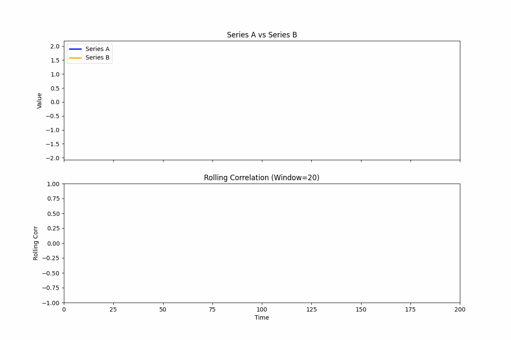
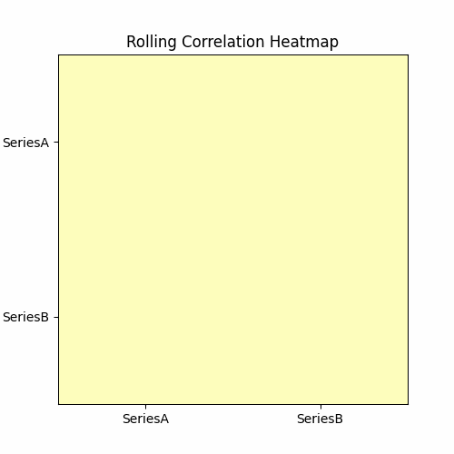

# 𝗗𝘆𝗻𝗮𝗺𝗶𝗰 𝗖𝗼𝗿𝗿𝗲𝗹𝗮𝘁𝗶𝗼𝗻𝘀 𝗶𝗻 𝗧𝗶𝗺𝗲 𝗦𝗲𝗿𝗶𝗲𝘀: 𝗩𝗶𝘀𝘂𝗮𝗹𝗶𝘇𝗶𝗻𝗴 𝗥𝗲𝗹𝗮𝘁𝗶𝗼𝗻𝘀𝗵𝗶𝗽𝘀 𝗢𝘃𝗲𝗿 𝗧𝗶𝗺𝗲

This project demonstrates **dynamic correlations in time series** using Python. Time series correlations are rarely static, and understanding their evolution can reveal hidden patterns, causal relationships, and temporal dependencies.  

Two related signals are simulated:  
- **Series A** – base signal  
- **Series B** – influenced by Series A with added noise  

A **rolling correlation** tracks how their relationship changes over time.  

## 🔹 Features

- **Line Plot Animation**: Shows Series A and B evolving together with rolling correlation.  
  

- **Heatmap Animation**: Displays a 2×2 correlation matrix updating dynamically.  
  

- Demonstrates causal relationships, temporal patterns, and real-time correlation analysis.
